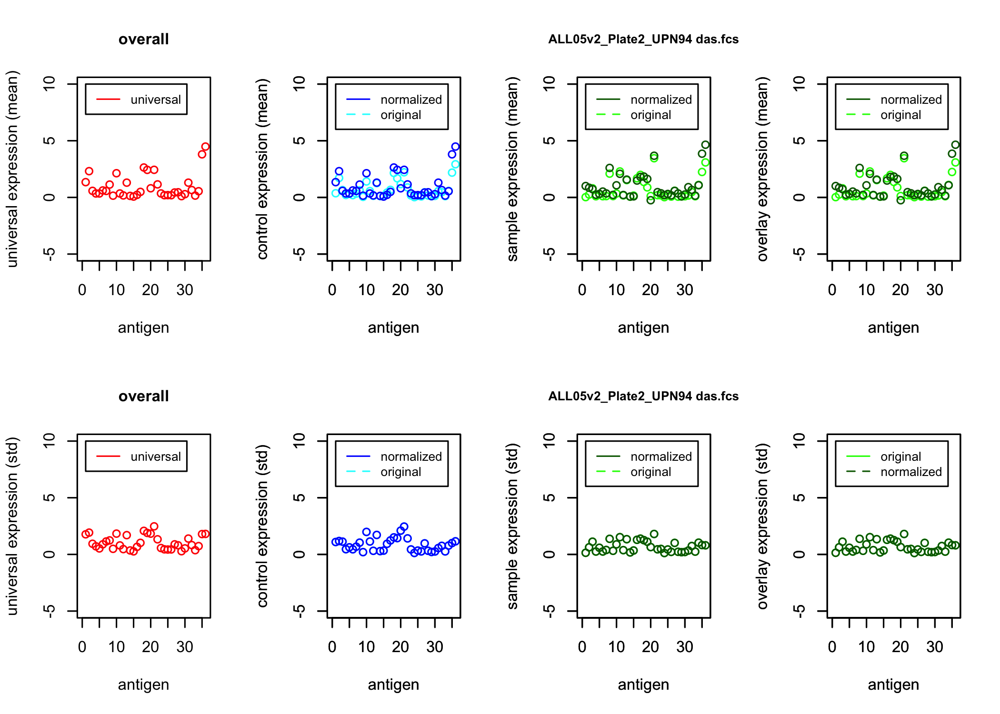
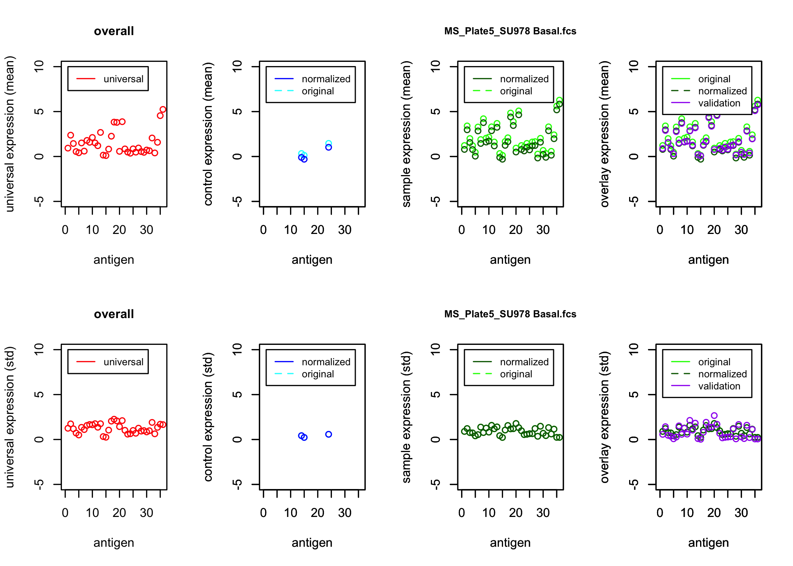

-   [cytofin](#cytofin)
    -   [Installation](#installation)
    -   [Data for this vignette](#data-for-this-vignette)
        -   [Establishing a root
            directory](#establishing-a-root-directory)
        -   [Downloading the data](#downloading-the-data)
    -   [Usage](#usage)
        -   [CyTOF data homogenization](#cytof-data-homogenization)
        -   [CyTOF batch normalization](#cytof-batch-normalization)
            -   [Batch normalization using external anchors
                (cytofin\_normalize)](#batch-normalization-using-external-anchors-cytofin_normalize)
                -   [1. Anchor preparation](#1-anchor-preparation)
                -   [2. Batch normalization](#2-batch-normalization)
            -   [Batch normalization using internal anchors
                (cytofin\_normalize\_nrs)](#batch-normalization-using-internal-anchors-cytofin_normalize_nrs)
    -   [Additional Information](#additional-information)

<!-- README.md is generated from README.Rmd. Please edit that file -->

# cytofin

CytofIn (**CyTOF** **In**tegration) is an R package for homogenizing and
normalizing heterogeneous [mass cytometry
(CyTOF)](https://pubmed.ncbi.nlm.nih.gov/21551058/) data from diverse
data sources. Specifically, CytofIn provides functions that perform the
following tasks:

-   **Dataset homogenization** - CyTOF datasets that were collected
    separately may differ in which markers were included in their
    antibody panels; in addition, they may use different naming
    conventions for their panels’ shared markers. Thus, data mining
    across multiple CyTOF datasets requires **homogenization,** the
    process of aligning each dataset’s antibody panels so that they can
    be analyzed together. In `CytofIn`, data homogenization (i.e. panel
    alignment) is performed with the `cytofin_homogenize` function that
    leverages user-provided panel information to combine datasets.
-   **Dataset normalization** - Combined analysis of multiple CyTOF
    datasets is likely to be confounded by dataset-to-dataset batch
    effects due to differences in instrumentation and experimental
    protocols between groups. To normalize multiple CyTOF datasets with
    respect to these batch effects, `CytofIn` provides 3 functions:
    `cytofin_prep_anchors`, `cytofin_normalize`, and
    `cytofin_normalize_nrs`.
-   **Visualization** - After batch normalization, the means and
    standard deviations for each of the input .fcs files (as well as
    their associated anchors) can be visualized using the
    `cytofin_make_plots` function.

The general CytofIn workflow unfolds in 3 steps. First, users align the
panels of the CyTOF datasets being integrated using
`cytofin_homogenize()`. Second, users generate reference statistics from
“generalized anchors” identified on each CyTOF plate (see below) using
`cytofin_prep_anchors()`. Finally, users can then normalize/batch
correct the datasets relative to one another using their choice of
`cytofin_normalize()` or `cytofin_normalize_nrs()`, each of which
performs the normalization procedure differently (see below).

## Installation

To install CytofIn, run the following code:

``` r
library(devtools)
install_github("bennyyclo/Cytofin")
```

To attach the CytofIn package to your current R session, run the
following line:

``` r
library(cytofin)
```

## Data for this vignette

### Establishing a root directory

For the sake of this vignette, we will work within a single folder,
where we will store the input data, the output data, and all
intermediate files from the CytofIn pipeline. We will default to using
the current working directory, but feel free to modify the following
line of code to change which path you want to use.

``` r
# change this path to wherever you want this vignette to find and store
# its input and output files
base_path <- getwd()
```

### Downloading the data

Now that we’ve identified the root directory we’ll use for this
vignette, we will create two folders in which we will store the raw
input data and the validation (bead-normalized) data used in this
vignette:

``` r
dir.create(file.path(base_path, "raw_data"), showWarnings = FALSE)
dir.create(file.path(base_path, "validation_data"), showWarnings = FALSE)
```

To fill each of these folders with the .fcs files we’re analyzing in
this vignette, please download the raw input files
[here](https://flowrepository.org/id/FR-FCM-Z427) and the validation
files [here](https://flowrepository.org/id/FR-FCM-Z42C) on
[FlowRepository](https://flowrepository.org/). Once the files are
downloaded, unzip them and add them to the `raw_data` and
`validation_data` folders that we just created, respectively.

## Usage

### CyTOF data homogenization

Here, the term “homogenization” refers to the process of aligning the
antigen panels of multiple CyTOF experiments by (1) removing all
channels that are not shared across all cohorts and (2) standardizing
the antigen names used to refer to each channel so that existing
analysis tools (like the `flowCore` and `tidyverse` packages) can be
applied in later analytical steps. In CytofIn, dataset homogenization is
performed using the `cytofin_homogenize()` function.

The `cytofin_homogenize()` function takes several arguments. The first
of these is `metadata_path`, a string that specifies the file path to a
.csv or .xlsx metadata file containing information about each of the
.fcs files being analyzed. Specifically, the metadata file will have one
row for each .fcs file being analyzed and must contain the following
columns (all of which will be converted to character vectors):

-   **filename -** Required. The name of the .fcs file within its local
    directory.
-   **cohort -** Required. The name of the cohort (i.e. experimental
    source) of each .fcs file.
-   **plate\_number -** Required. The name of the CyTOF plate (e.g.
    “plate1”, “plate2”, etc.) on which the sample corresponding to each
    .fcs file was analyzed during data acquisition.
-   **patient\_id -** Optional. The name of the patient to whom each
    .fcs file corresponds.
-   **condition -** Optional. The stimulation condition corresponding to
    each .fcs file (i.e. “basal”, “IL-3”, etc.).
-   **is\_anchor -** Required. A numeric column indicating whether or
    not each sample should be used as an “anchor” for the batch
    correction procedure (1 if yes; 0 if no). Exactly one anchor should
    be identified for each CyTOF plate being analyzed.
-   **validation -** Optional. The name of the
    [bead-normalized](https://pubmed.ncbi.nlm.nih.gov/23512433/) .fcs
    file corresponding to each input file listed in the `filename`
    column (per gold-standard batch normalization procedure in CyTOF
    batch correction). Most users will ignore this column because
    bead-normalized data will not be available, but it can be used to
    validate the results of the CytofIn batch normalization algorithms
    if bead-normalized data are available.

Importantly, only the fields marked as “required” are needed for
`cytofin_homogenize()` to work; “NA” can be recorded for any/all
optional columns that don’t apply to the experimental design of the
files being analyzed (for example, if no stimulation conditions were
used in the studies being integrated, enter “NA” for each element of the
`condition` column). Alternatively, these columns can be omitted from
the metadata table entirely. The `cytofin_generate_metadata_template`
function is provided to generate an example metadata .csv file filled
with dummy example data in a location specified by the user:

``` r
# specify the path where you'd like to store the template file
my_path <- file.path(base_path, "template_folder")

# generate the template file, which then can be edited manually 
cytofin_generate_metadata_template(template_path = my_path)
```

The second argument for `cytofin_homogenize` is `panel_path`, a string
that specifies the file path to a .csv or .xlsx file containing
information about the panel(s) of each of the .fcs files being analyzed.
Each row represents a channel (i.e. a protein measurement) to be
included in the final, homogenized panel. This file must contain the
following columns:

-   **metal\_name -** A character vector representing the name of the
    metal isotope measured by each channel.
-   **antigen\_name -** A character vector representing the name of the
    antigen associated with a given metal isotope in the consensus panel
    (the final antigen name to assign to a given channel during
    homogenization).
-   **antigen\_pattern -** A regular expression used to match antigen
    names that may differ slightly across different .fcs files. For
    example, the regular expression “(C\|c)(D\|d)45” will detect all of
    the following channel names: “cd45”, “CD45”, “Cd45”, or “cD45”.
-   **lineage -** A numeric vector representing whether or not a marker
    is a lineage marker (1 if yes; 0 otherwise).
-   **functional -** A numeric vector representing whether or not a
    marker is a functional marker (1 if yes; 0 otherwise).
-   **general -** A numeric vector representing whether or not a marker
    is a “general” (i.e. neither a lineage nor a functional) marker (1
    if yes; 0 otherwise).

The layout of this antigen panel is displayed graphically below.


As above, the `cytofin_generate_panel_template` function is provided to
generate an example metadata .csv file filled with dummy example data:

``` r
my_path <- file.path(base_path, "template_folder")

# generate the template file, which then can be edited manually 
cytofin_generate_panel_template(template_path = my_path)
```

For many users, the most difficult part of filling out the consensus
panel information table will be designing the regular expressions for
the `antigen_pattern` column. However, in most cases the required
regular expressions will be quite simple; for a primer on regular
expressions (and their use in the
[`stringr`](https://stringr.tidyverse.org/) package) written by
[RStudio](https://www.rstudio.com/about/), install the `stringr` package
and read the following vignette:

``` r
vignette(topic = "regular-expressions", package = "stringr")
```

The next two arguments for `cytofin_homogenize` are `input_data_path`
and `output_data_path`, two strings that indicate which directory input
.fcs files should be read from and which directory homogenized .fcs
files should be written to, respectively. Lastly, the final two
arguments are optional: `prefix` allows the user to specify the prefix
appended to each input .fcs file name to get the name of the
corresponding output (i.e. homogenized) .fcs file name, and `verbose` is
a boolean value (default = FALSE) specifying if chatty print statements
should be made while the homogenization is performed.

Using these arguments, `cytofin_homogenize` can homogenize a set of
CyTOF files with distinct antigen naming conventions. Specifically, the
program performs a regular expression search to match the synonymous
term in the panel and correct the antigen name with standardized names
in the panel.

Example function call:

``` r
# define input paths 
metadata_path <- 
  system.file(
    file.path("extdata", "test_metadata_raw.csv"), 
    package = "cytofin"
  )

panel_path <- 
  system.file(
    file.path("extdata", "test_panel.csv"), 
    package = "cytofin"
  )

input_data_path <- 
  file.path(base_path, "raw_data")

validation_data_path <- 
  file.path(base_path, "validation_data")

# define output path
# --Change this line to wherever you want the output files saved!--
output_data_path <- file.path(base_path, "homogenization_output")

# call homogenization function
cytofin_homogenize(
  metadata_path = metadata_path, 
  panel_path = panel_path, 
  input_data_path = input_data_path, 
  output_data_path = output_data_path
)
```

This function call will save homogenized .fcs files to the directory
located at `output_data_path`. These files will be different from the
input .fcs files in the `input_data_path` directory in that they will
only contain channels whose antigen names match the `antigen_pattern`
column of the reference panel located at `panel_path`. All other
channels will be removed, and the names of the channels with matches in
`antigen_pattern` will be standardized to the names given in the
`antigen_name` column of the reference panel.

The input files for this homogenization run were as follows:

``` r
list.files(input_data_path, pattern = ".fcs$")
#>  [1] "ALL05v2_Plate2_healthy basal1.fcs" "ALL05v2_Plate2_UPN94 das.fcs"     
#>  [3] "ALL08_Plate8_Healthy03 basal.fcs"  "ALL08_Plate8_UPN26 basal.fcs"     
#>  [5] "CRLF2_Plate1_Healthy 04 BCR.fcs"   "CRLF2_Plate1_UPN53 das + TSLP.fcs"
#>  [7] "MS_Plate5_Healthy BM.fcs"          "MS_Plate5_SU978 Basal.fcs"        
#>  [9] "SJ_Plate2_Healthy_BM.fcs"          "SJ_Plate2_TB010950_Basal.fcs"
```

…and the corresponding output file saved in the `output_data_path`
directory are now as follows:

``` r
list.files(output_data_path, pattern = ".fcs$")
#>  [1] "homogenized_ALL05v2_Plate2_healthy basal1.fcs"
#>  [2] "homogenized_ALL05v2_Plate2_UPN94 das.fcs"     
#>  [3] "homogenized_ALL08_Plate8_Healthy03 basal.fcs" 
#>  [4] "homogenized_ALL08_Plate8_UPN26 basal.fcs"     
#>  [5] "homogenized_CRLF2_Plate1_Healthy 04 BCR.fcs"  
#>  [6] "homogenized_CRLF2_Plate1_UPN53 das + TSLP.fcs"
#>  [7] "homogenized_MS_Plate5_Healthy BM.fcs"         
#>  [8] "homogenized_MS_Plate5_SU978 Basal.fcs"        
#>  [9] "homogenized_SJ_Plate2_Healthy_BM.fcs"         
#> [10] "homogenized_SJ_Plate2_TB010950_Basal.fcs"
```

### CyTOF batch normalization

After dataset homogenization, **batch correction** (or **batch
normalization**) can be performed across datasets. The following
schematic diagram illustrates how normalization is performed in
`CytofIn`:


TO DO: Fix a few things about this schematic diagram

In words, CytofIn performs batch normalization though the use of
user-identified **anchors -** or \[TO DO: definition of anchors\]. These
anchors can be either external (TO DO: which means this) or internal (TO
DO: which means this). To batch normalize using external anchors (which
is ideal when such anchors are available), use `cytofin_normalize`. To
batch normalize using internal anchors (which is ideal when no external
anchors are available), use `cytofin_normalize_nrs`.

The use of both of these functions is detailed below.

#### Batch normalization using external anchors (cytofin\_normalize)

The `cytofin_normalize` uses user-identified external anchors on each
CyTOF plate being integrated to correct batch effects on a
plate-to-plate basis. One sample on each CyTOF barcoding plate should be
chosen as that plate’s external anchor. In general, external anchors
should be chosen based on which samples are the most biologically
similar to one another from plate to plate. For example, if healthy,
non-stimulated samples are included on each CyTOF plate being
integrated, the only expected variability between these samples other
than batch effects would be person-to-person variability. Thus, these
samples are likely to be biologically similar to one another and are
suitable to be chosen as external anchors. Alternatively, if a single
patient or cell line was included on every CyTOF plate being integrated,
the samples corresponding to that patient or cell line on each plate are
would also be suitable as external anchor choices.

Once users have identified 1 external anchor per plate for `CytofIn`
data integration, users must mark its row in the metadata table with a
“1” in the `is_anchor` column (all other samples should be marked with
“0”). `CytofIn` then uses these anchors to define a **universal mean**
and **universal variance** that represent the central tendency and
dispersion, respectively, of the target distribution to which all
samples will be batch corrected. This correction will be performed with
the user’s choice from one of five batch correction functions.

In short, `CytofIn`’s batch normalization procedure using external
anchors has two steps:

1.  Preparation of external anchors  
2.  Application of a transformation function that performs the batch
    correction (of which `CytofIn` provides 5 options)

We detail function calls for each of these steps below.

##### 1. Anchor preparation

The `cytofin_prep_anchors` function concatenates the identified anchor
files and then calculates summary statistics that are used for batch
correction in later steps of the pipeline. First, `CytofIn` calculates
the mean and standard deviation of each channel in the homogenized
dataset across all cells from samples identified as external anchors.
These values represent the overall central tendency and dispersion,
respectively, of each channel among the anchor samples on each CyTOF
plate; thus, we call them the **universal means** and **universal
variances** of the `CytofIn` integration. Accordingly, the universal
mean and universal variance vectors will each have *g* elements, where
*g* is the number of channels in the consensus antigen panel in the
panel information table. The universal mean and universal variance
vectors are used in the `meanshift`, `variance`, `z-score`, and
`beadlike` methods of batch correction (see below).

In addition, the mean of all of the elements of the universal mean
vector (i.e. the mean of all channel means) and the mean of all of the
elements of the universal variance vector (i.e. the mean of all channel
variances) are calculated. These values represent the central tendency
and dispersion of antigen measurements in general among the healthy
control samples on each CyTOF plate and are thus no longer
channel-specific. Thus, we call them the *bulk mean* and *bulk
variance*, and they are used in the `meanshift_bulk` batch correction
method implemented in `cytofin_homogenize`.

To calculate these values, we use the `cytofin_prep_anchors` function.
`cytofin_prep_anchors` returns the universal mean vector, universal
variance vector, bulk mean, and bulk variance as a `list()`. In
addition, users are given an option to save these statistics as an .rds
file in a specified directory in order to avoid performing redundant
calculations in future analyses.

Specifically, `cytofin_prep_anchors` takes 4 required arguments:

-   `metadata_path`: A connection leading to an .xlsx or .csv file
    containing a metadata table with information about each file to be
    analyzed. This file should be identical to that used for
    `cytofin_homogenize`.
-   `panel_path`: A connection leading to an .xlsx or .csv file
    containing information about the standardized antigen panel in the
    homogenized dataset. This file should be identical to that used for
    `cytofin_homogenize`.
-   `input_data_path`: A connection to a directory containing the input
    .FCS files from which to draw summary statistics
-   `output_path`: A connection to a directory where the output .rds and
    .FCS files will be saved. The default is “none”, in which case no
    output files will be stored (and the only effect of the function
    will be to return the calculated statistics as a `list()`).

In addition, `cytofin_prep_anchors` also takes 2 optional arguments
relating to the conventional arcsinh transformation performed on the raw
ion counts of the input data. These optional arguments are as follows:

-   `shift_factor`: The scalar value `a` in the following equation used
    to transform CyTOF raw data ion counts using the hyperbolic arcsinh
    function: `new_x <- asinh(a + b * x)`. Defaults to 0.

-   `scale_factor`: The scalar value `b` in the following equation used
    to transform CyTOF raw data ion counts using the hyperbolic arcsinh
    function: `new_x <- asinh(a + b * x)`. Defaults to 0.2.

Finally, here is an example functional call of `cytofin_prep_anchors`:

``` r
input_data_path <- file.path(base_path, "homogenization_output")
output_path <- file.path(base_path, "anchor_prep_output")

anchor_statistics <- 
  cytofin_prep_anchors(
    metadata_path = metadata_path, 
    panel_path = panel_path, 
    input_data_path = input_data_path, 
    output_path = output_path
  )

print(anchor_statistics)
#> $universal_var
#>         Time Event_length    (Pd102)Di    (Pd104)Di    (Pd105)Di    (Pd106)Di 
#>   1.28235792   0.16399756   6.78770451   0.89290897   5.74351522   4.00916670 
#>    (Pd108)Di    (Pd110)Di    (In113)Di    (In115)Di    (La139)Di    (Pr141)Di 
#>   6.47944462   6.14839951   3.14291787   3.69776978   0.31651260   0.20067263 
#>    (Nd142)Di    (Nd143)Di    (Nd144)Di    (Nd145)Di    (Nd146)Di    (Sm147)Di 
#>   0.88280840   0.50837979   0.18512779   0.27893442   0.79089548   1.30174061 
#>    (Nd148)Di    (Sm149)Di    (Nd150)Di    (Sm152)Di    (Eu153)Di    (Sm154)Di 
#>   1.53148051   0.24234410   0.19237185   0.78984151   3.36668746   0.64687396 
#>    (Gd156)Di    (Gd158)Di    (Gd160)Di    (Dy161)Di    (Dy162)Di    (Dy163)Di 
#>   0.62963342   0.21865740   2.88801028   0.07940630   0.12194444   0.07128214 
#>    (Dy164)Di    (Ho165)Di    (Er166)Di    (Er167)Di    (Er168)Di    (Er170)Di 
#>   0.44285804   1.04235848   0.28206380   4.31831331   3.59089444   3.35406088 
#>    (Yb171)Di    (Yb172)Di    (Yb173)Di    (Yb174)Di    (Lu175)Di    (Yb176)Di 
#>   1.95310084   0.67905696   0.13911985   6.12832312   1.77734024   0.53625671 
#>    (Ir191)Di    (Ir193)Di 
#>   3.21574811   3.27089639 
#> 
#> $universal_mean
#>         Time Event_length    (Pd102)Di    (Pd104)Di    (Pd105)Di    (Pd106)Di 
#>  14.50995327   2.30820954   3.48055714   1.06062913   4.08199057   4.77092034 
#>    (Pd108)Di    (Pd110)Di    (In113)Di    (In115)Di    (La139)Di    (Pr141)Di 
#>   2.69248853   3.31279576   1.34656332   2.31588156   0.35046633   0.19319399 
#>    (Nd142)Di    (Nd143)Di    (Nd144)Di    (Nd145)Di    (Nd146)Di    (Sm147)Di 
#>   0.57791130   0.34730008   0.20086489   0.34646560   0.61382685   0.56851774 
#>    (Nd148)Di    (Sm149)Di    (Nd150)Di    (Sm152)Di    (Eu153)Di    (Sm154)Di 
#>   1.13302732   0.15299272   0.19208744   0.43406391   2.13362865   0.45270859 
#>    (Gd156)Di    (Gd158)Di    (Gd160)Di    (Dy161)Di    (Dy162)Di    (Dy163)Di 
#>   0.34711746   0.17472376   1.30261426   0.11212254   0.13257570   0.07266354 
#>    (Dy164)Di    (Ho165)Di    (Er166)Di    (Er167)Di    (Er168)Di    (Er170)Di 
#>   0.22465161   0.48758658   0.28522175   2.63843957   2.43044297   0.80540655 
#>    (Yb171)Di    (Yb172)Di    (Yb173)Di    (Yb174)Di    (Lu175)Di    (Yb176)Di 
#>   1.30095098   0.65077576   0.15830507   2.43474419   1.14821570   0.54578885 
#>    (Ir191)Di    (Ir193)Di 
#>   3.80031272   4.48577210 
#> 
#> $bulk_var
#> [1] 1.467075
#> 
#> $bulk_mean
#> [1] 0.969387
```

As shown above, the returned value is a list with 4 items in it: the
universal variance vector (`universal_var`), the universal mean vector
(`universal_mean`), the bulk variance (`bulk_var`) and the bulk mean
(`bulk_mean`). Note that the elements of `universal_var` and
`universal_mean` are named with their corresponding metal names (not
antigen names), as this interfaces a bit more conveniently with the
`flowCore` functions that `CytofIn` uses under-the-hood.

Importantly, you only need to use `cytofin_prep_anchors` if you plan to
batch normalize your .fcs files using external anchors identified on
each plate (using `cytofin_normalize`). If you plan to batch normalize
your .fcs files using non-redundancy scores from each sample’s most
stable channels (using `cytofin_normalize_nrs`), you do not need to run
`cytofin_prep_anchors` first.

##### 2. Batch normalization

After the anchors’ summary statistics are computed, batch correction
using external anchors can be performed using either
`cytofin_normalize`. This function can perform batch correction using 5
different transformation functions (which we call “modes”). Which of
these is most applicable to a given analysis will differ from user to
user. We recommended that users try using both and then manually
inspect/visualize the batch-corrected data in order to determine which
method they prefer.

To perform batch normalization using external anchors identified on each
plate, use `cytofin_normalize`. This batch normalization strategy
assumes that the anchors on each plate are relatively similar to one
another, and it uses this similarity to adjust the marker expression
measurements on each plate based on how much each plate’s anchor differs
from the other anchors. The `cytofin_normalize` function takes several
required arguments:

-   `metadata_path`: A connection leading to an .xlsx or .csv file
    containing a metadata table with information about each file to be
    analyzed. This file should be identical to that used for
    `cytofin_homogenize`.
-   `panel_path`: A connection leading to an .xlsx or .csv file
    containing information about the standardized antigen panel in the
    homogenized dataset. This file should be identical to that used for
    `cytofin_homogenize`.
-   `anchor_statistics`: Either a list of numeric values produced by the
    `cytofin_prep_anchors` function or a connection leading to an .rds
    object containing anchor statistics.
-   `input_data_path`: A connection to a directory containing the input
    .fcs files to be batch normalized. In most cases, this will be the
    directory to which the output .FCS files from `cytofin_homogenize`
    were written.
-   `output_data_path`: A connection to a directory where the output
    (i.e. batch normalized) .FCS files will be written.
-   `mode`: A string indicating which transformation function should be
    used for batch normalization (“meanshift”, “meanshift\_bulk”,
    “variance”, “z-score”, or “beadlike”).

In addition to these required arguments, `cytofin_normalize` takes
several optional arguments:

-   `input_prefix`: The string that was appended to the name of the raw
    input .fcs files of `cytofin_homogenize` to create their
    corresponding output file names. Defaults to “homogenized\_”.

-   `output_prefix`: The string to be appended to the name of each input
    .fcs file to create the name of the corresponding output file
    (post-homogenization). Defaults to “normalized\_”.

-   `shift_factor` and `scale_factor`: The scalar values *a* and *b*,
    respectively, to be used in the hyperbolic arc-sine function used to
    transform CyTOF ion counts according to the following equation:
    `new_x <- asinh(a + b * x)`. `shift_factor` defaults to 0 and
    `scale_factor` defaults to 0.2, which are customary values used by
    most scientists in the CyTOF community.

Using these arguments, a call to `cytofin_normalize` will perform the
batch correction and save the output (i.e. batch normalized) .fcs files
to the directory specified by `output_data_path`. An example function
call is given here:

``` r
output_data_path <- 
  file.path(base_path, "normalization_results")

norm_result <- 
  cytofin_normalize(
    metadata_path = metadata_path, 
    panel_path = panel_path, 
    anchor_statistics = anchor_statistics, 
    input_data_path = input_data_path, 
    output_data_path = output_data_path, 
    mode = "meanshift"
  )
#> Warning in dir.create(output_data_path): '/Users/tkeyes/Desktop/cytofin_tests/
#> normalization_results' already exists
```

When this function is called, it has two effects. The first is to save
the batch-normalized output .fcs files to the `output_data_path`
directory. The second is to return a data.frame that stores mean and
variance information about each input file (as well as its associated
anchor) both before and after normalization. This data.frame can be
passed directly into the `cytofin_make_plots` function to return 8
diagnostic plots per sample illustrating the quality of the
normalization:

``` r
# we make only the plot for the first input .fcs file
# for illustrative purposes
cytofin_make_plots(
  normalization_result = norm_result,
  which_rows = 1,
  val_path = "none"
)
```



#### Batch normalization using internal anchors (cytofin\_normalize\_nrs)


In the event that external anchors are not available, `CytofIn` can use
“internal anchors” within each sample for batch normalization.
Specifically, instead of defining a single external anchor for all the
samples on a given plate like `cytofin_normalize`, the
`cytofin_normalize_nrs` function identifies the most stable channels in
the dataset overall and uses them as internal anchors that are used to
batch normalize all other channels from sample-to-sample. To identify
the most stable channels in the combined dataset, `CytofIn` uses a
PCA-based non-redundancy score (NRS) as described before (see
[here](https://pubmed.ncbi.nlm.nih.gov/26095251/)). A minimum of 3
channels should be selected to establish an internal reference from
which signals can be calibrated between CyTOF files.

To do so, `cytofin_normalize_nrs` takes several of the same arguments as
`cytofin_normalize`, defined as above: `metadata_path`, `panel_path`,
`input_data_path`, `output_data_path`, `input_prefix`, `output_prefix`,
`shift_factor`, and `scale_factor`. In addition, it takes the following
optional arguments:

-   `nchannels`: An integer representing the number of “most stable”
    (i.e. with the lowest non-redundancy scores) channels that should be
    used for batch normalization. Defaults to 3.

-   `make_plot`: A boolean value representing if, in addition to its
    other effects, `cytofin_normalize_nrs` should return a plot
    illustrating the distribution of non-redundancy scores for each
    channel among all .fcs files being batch normalized. Defaults to
    FALSE.

These arguments can be used in a function call as follows:

``` r
# path to save the normalized .fcs files
output_data_path <- 
  file.path(base_path, "normalization_nrs_results")

# call function
norm_result_nrs <- 
  cytofin_normalize_nrs(
    metadata_path = metadata_path, 
    panel_path = panel_path, 
    input_data_path = input_data_path, 
    output_data_path = output_data_path, 
    nchannels = 3, 
    make_plot = FALSE
  )
#> Warning in dir.create(output_data_path): '/Users/tkeyes/Desktop/cytofin_tests/
#> normalization_nrs_results' already exists
```

Just like `cytofin_normalize` above, `cytofin_normalize_nrs` has several
effects. First, it writes batch-normalized .fcs files to
`output_data_path` and makes a plot depicting sample-wise and
channel-wise non-redundancy scores according to the value of
`make_plot`. In addition, it returns a data.frame that can be passed
into `cytofin_make_plots` to make diagnostic plots regarding the batch
normalization procedure:

``` r
# show only 1 set of plots for illustrative purposes
cytofin_make_plots(
  normalization_result = norm_result_nrs, 
  which_rows = 7, 
  val_path = validation_data_path
)
```



## Additional Information

For questions about the `cytofin` R package, please email
<kardavis@stanford.edu> or open a GitHub issue
[here](https://github.com/bennyyclo/Cytofin).

``` r
# session information for rendering this README file
sessionInfo()
#> R version 4.0.3 (2020-10-10)
#> Platform: x86_64-apple-darwin17.0 (64-bit)
#> Running under: macOS Big Sur 10.16
#> 
#> Matrix products: default
#> BLAS:   /Library/Frameworks/R.framework/Versions/4.0/Resources/lib/libRblas.dylib
#> LAPACK: /Library/Frameworks/R.framework/Versions/4.0/Resources/lib/libRlapack.dylib
#> 
#> locale:
#> [1] en_US.UTF-8/en_US.UTF-8/en_US.UTF-8/C/en_US.UTF-8/en_US.UTF-8
#> 
#> attached base packages:
#> [1] stats     graphics  grDevices utils     datasets  methods   base     
#> 
#> other attached packages:
#> [1] cytofin_0.0.0.9000
#> 
#> loaded via a namespace (and not attached):
#>  [1] Rcpp_1.0.6          highr_0.9           compiler_4.0.3     
#>  [4] pillar_1.6.0        cytolib_2.2.1       tools_4.0.3        
#>  [7] digest_0.6.27       evaluate_0.14       lifecycle_1.0.0    
#> [10] tibble_3.1.0        pkgconfig_2.0.3     rlang_0.4.10       
#> [13] DBI_1.1.1           yaml_2.2.1          parallel_4.0.3     
#> [16] xfun_0.22           dplyr_1.0.5         stringr_1.4.0      
#> [19] knitr_1.32          hms_1.0.0           generics_0.1.0     
#> [22] S4Vectors_0.28.1    vctrs_0.3.7         stats4_4.0.3       
#> [25] tidyselect_1.1.0    glue_1.4.2          Biobase_2.50.0     
#> [28] R6_2.5.0            fansi_0.4.2         rmarkdown_2.7      
#> [31] readr_1.4.0         tidyr_1.1.3         RProtoBufLib_2.2.0 
#> [34] purrr_0.3.4         magrittr_2.0.1      matrixStats_0.58.0 
#> [37] htmltools_0.5.1.1   ellipsis_0.3.1      BiocGenerics_0.36.1
#> [40] assertthat_0.2.1    flowCore_2.2.0      utf8_1.2.1         
#> [43] stringi_1.5.3       RcppParallel_5.1.2  crayon_1.4.1
```
